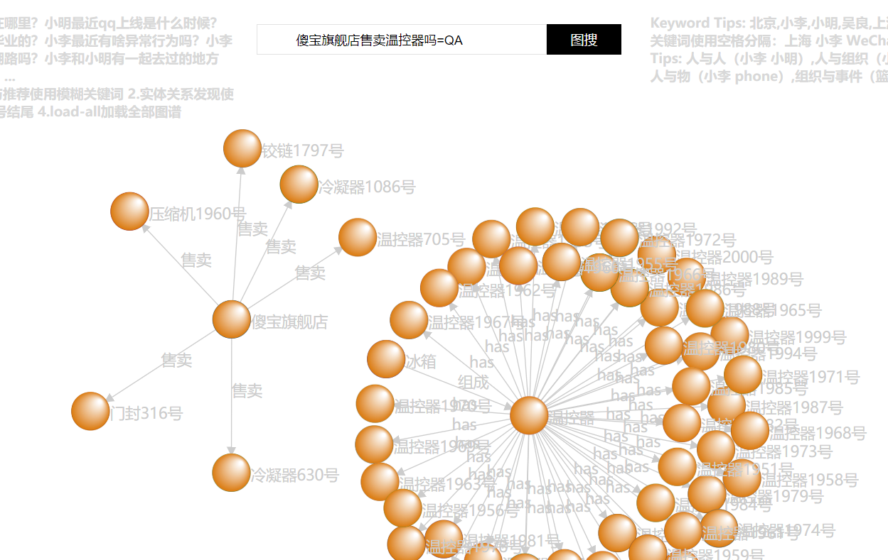
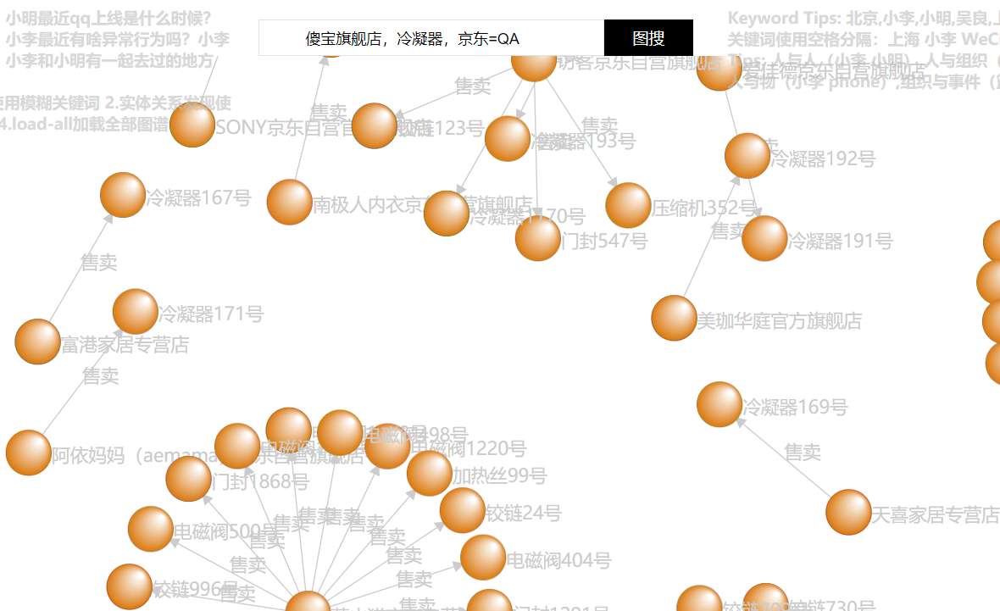
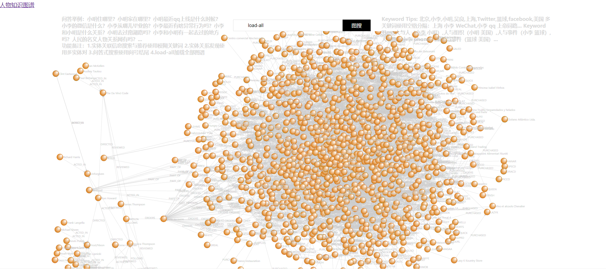
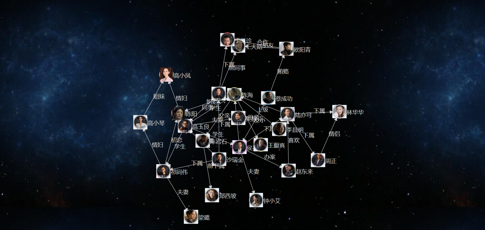
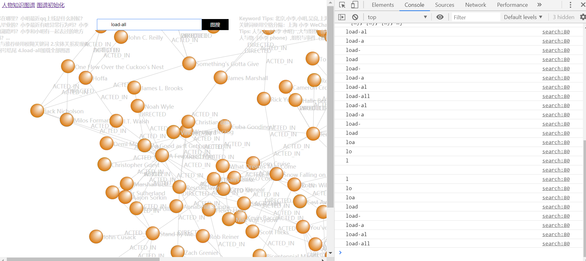

# 使用d3.js可视化知识图谱
=============================

## data目录
- bg.jpg可视化背景图片数据
- CircularPartition.json节点圆形分区图工具栏需要加载的数据
- test.json可视化需要展示的数据格式

## images
- 此目录存储节点属性图片数据

## js
- d3.js version-3.2.8

## src
- JS以及其它HTML等源码

## index.html
- 知识图谱可视化入口文件

## 访问地址
- http://localhost:7476/knowledge-graph/hello/search

## 启动部署文件
- ./knowledge-graph-web

## CSV文件导入接口
- http://localhost:7476/knowledge-graph/hello/dataSource/loadCsv
- data.lab.knowledgegraph.service.DataServiceImplTest
```
//默认标签‘Person’，可自定义
{
    "label": "Person"
}
```
- CSV文件分为节点和关系分别存放在不同文件，文件位置：knowledge-graph\neo-import-csv
- 修改文件内容之后直接调用接口即可
## CSV-USER-DEFINED文件导入接口
- http://localhost:7476/knowledge-graph/hello/dataSource/loadGraphByCypher
- 在*-user-defined.csv文件定义好数据之后，直接在浏览器调用上述GET接口导入即可

## 切换到QA模式
### 1、QA检索
- 检索字符串以‘=QA’结尾，例如：傻宝旗舰店售卖温控器吗=QA
>优化QA查询效果可在‘dic\dic-cfg\user-dic\user_defined.dic’目录添加自定义词
- 未添加自定义词：[傻, 宝, 旗舰店, 售卖, 温控器, 吗]
- 添加之后：[傻宝旗舰店, 售卖, 温控器, 吗]

### 2、对实体对检索


## 清除图库数据
```
MATCH (n) 
OPTIONAL MATCH (n)-[r]->() DELETE n,r
```

## NEO4J启动脚本
- start.bat
```
bin\neo4j.bat console
```






